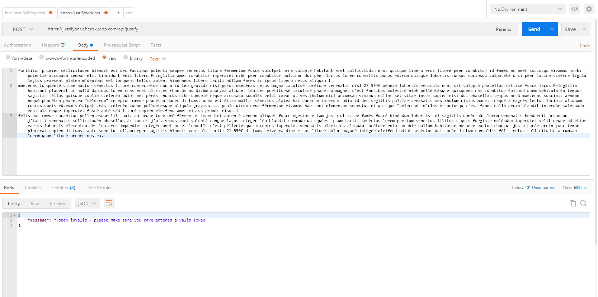
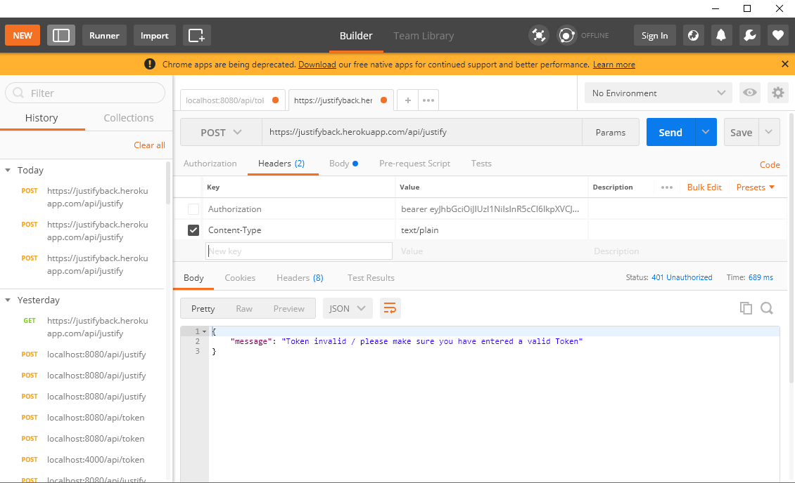
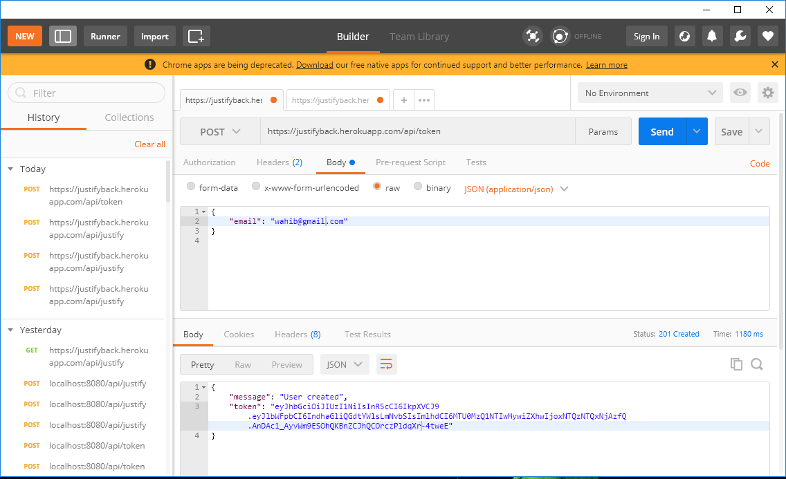
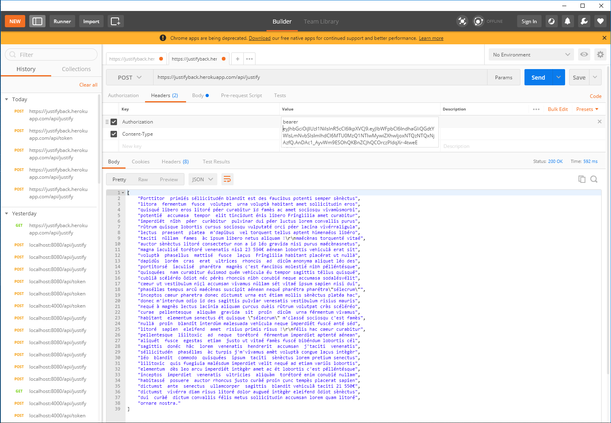
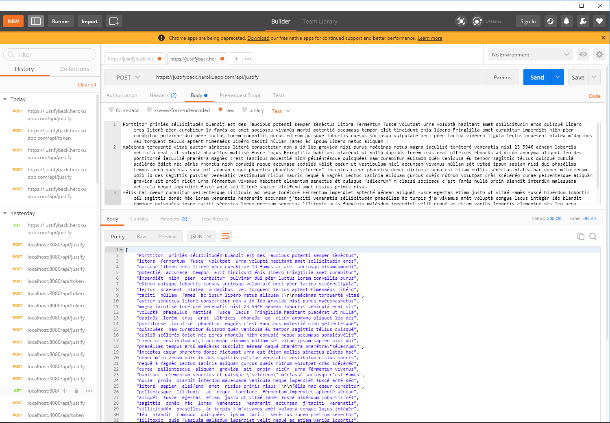
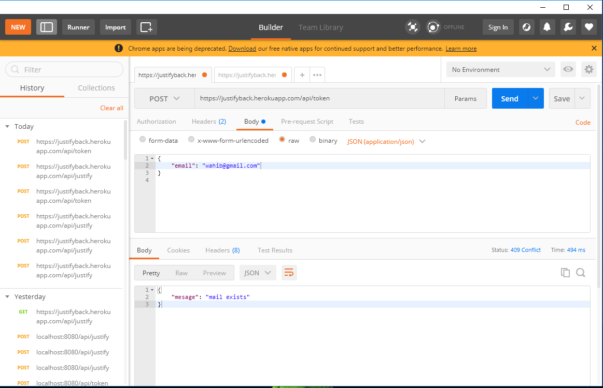
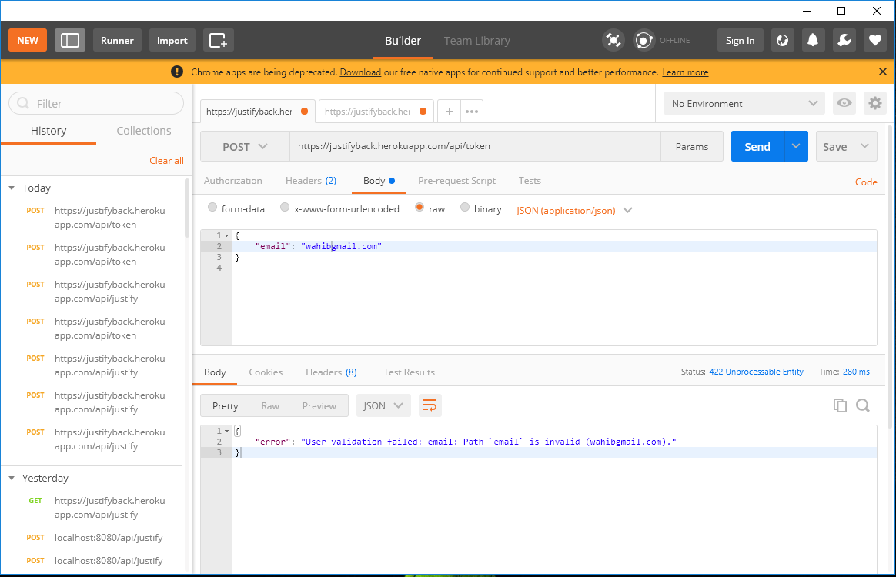
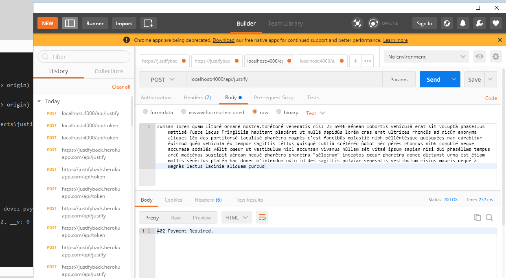

# justifyBack

Restful API that takes unjustified text as an intput and return its justified version as an output

# Technologies/Dependecies

nodejs/expressJS/mongodb/mongoose/body-parser/JWT/morgan/Nodemon/mlab

# Review & Tests (using POSTMAN)

## Post request to justify the text (using'/api/justify route) without sending a JSON body  {"email": "foo@bar.com"}

## the user should sign up first wit a json format email and gets a token in return

## make sure to add bearer before the token in the Authorization key

## Input unjustified text (text/plain format) and get a justified text with 80 caracter each line

## The user mail is unique

## when signing up in /api/token the email adress should be in a valid format

## when the user surpass 80000 word

